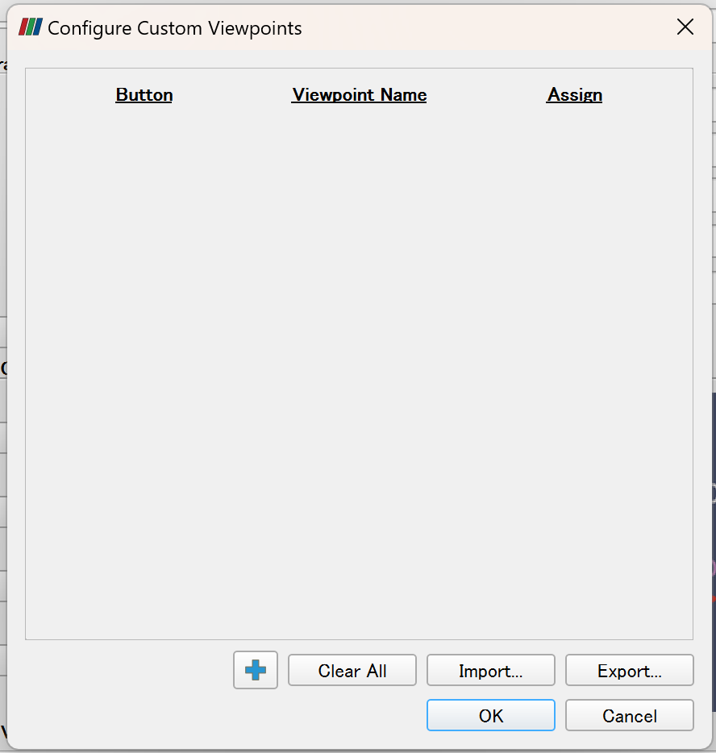
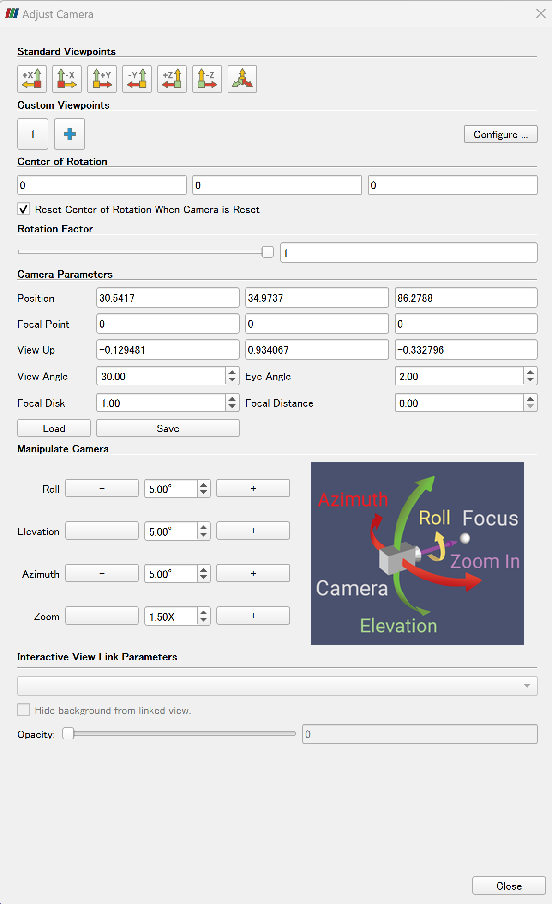

# Paraview-Camera-Settings
This post describes some tips on how to set multiple view in paraview, as well as how to change camera position to create fancy videos

Use the wavelet source as an example
1. Panel Sources / Alphabetical / Wavelet (The data will be imported as Wavelet1)

2. visualize with RTData using surface visualization, you may get the following figure

3. To save the current camera position, you can click on the **Adjust Camera** icon on the RenderView1
  click the **Configure** bottom

click the <+> bottom then click the Current ViewPoint to save the current camera position.
then you will find a **1** will appear on the bottom of **Custom Viewpoints** .

4.

